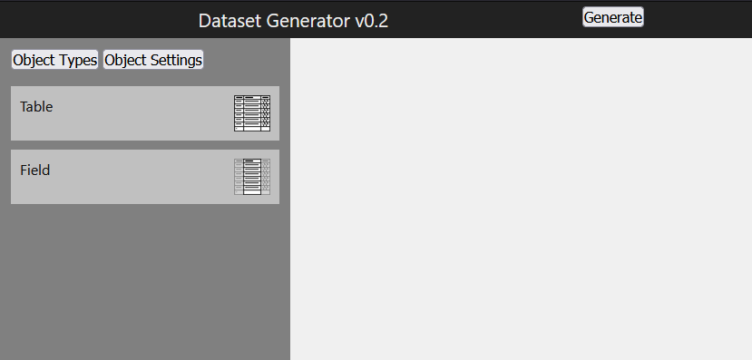
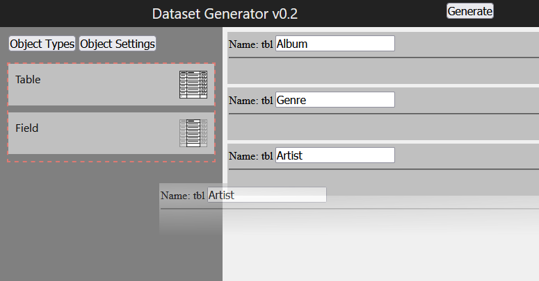
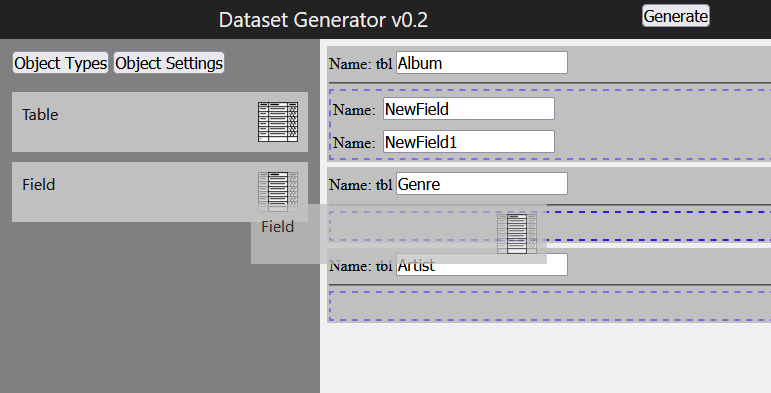
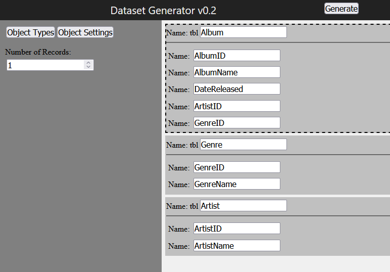
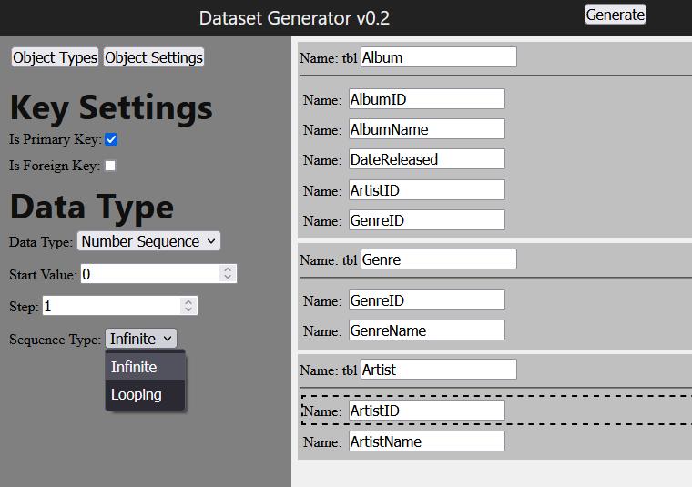
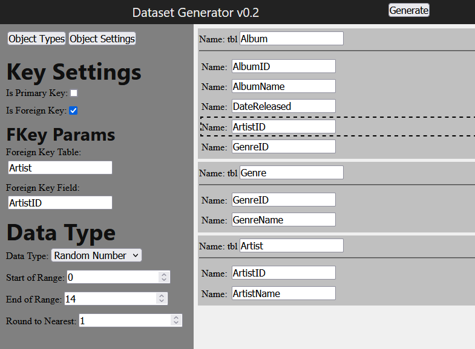
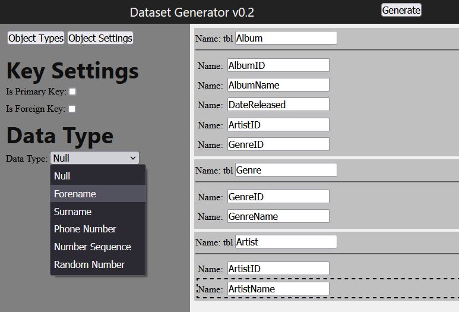

# Dataset Generator
###### [Another one](https://github.com/musicmrman99/dataset-generator "Dataset Generator (the first one)") ...
A web app to generate a multi-table or single-table (JOINed) random dataset,
given a relational structure and generator parameters.

## Install and Build

### Install & Initial Setup

1. Install conda (anaconda or miniconda, I use miniconda): https://docs.conda.io/projects/conda/en/latest/user-guide/install/index.html
   - If using Git Bash, add conda to the git bash environment by adding `. <conda-install-dir>/etc/profile.d/conda.sh` to your `~/.bash_profile` or `~/.bashrc`.

2. Run:
```
git clone https://github.com/musicmrman99/dataset-generator-react.git dataset-generator
cd dataset-generator
conda create -y -p ./conda-env -c conda-forge --file deps.txt --file build-deps.txt
conda activate ./conda-env
npm install
```

### Build

Activate the conda env using `conda activate ./conda-env` (if not already active), then:
```
npm run webpack
```

### Run

- Live:
```
python ./dataset-generator.py
```

- Development:
```
FLASK_ENV='development' python ./dataset-generator.py
```

# Usage

On starting the app, you'll see the "Object Types" side pane and the workspace.



You can then make tables by dragging the 'Table' type onto the workspace. To remove a created object (table or field), drag it back into the object types pane.



Once you have tables, you can add fields to those tables by dragging the 'Field' type onto a table.



Select a table by clicking on it (not on one of its fields). You can edit its settings by swapping to the "Object Settings" tab on the left pane.



Tables have one setting: how many records you want to generate for that table. You can also select a field (click on it) and edit its settings. DBGen has some common generation types built in.



You can also mark fields as a foreign key, then set their type and values to be something that will be compatible with the type of the primary key they link to.



DBGen can also make names. It has an internal list of a few hundred possibilities, so you will have duplicates if you make more records than that - that may be useful for testing.



Clicking 'Generate' will start a download of a file. What type of file depends on how many tables you have specified:

- 1 table -> A csv text file with your table's generated data
- 2+ tables -> a zip file containing csv text files with each of your tables' generated data
